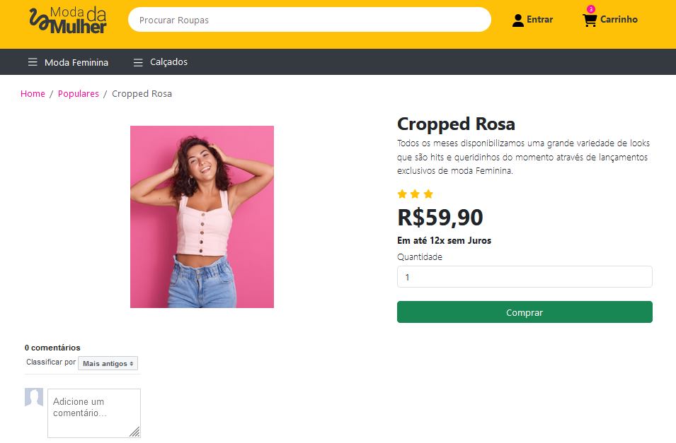

# Projeto de Site de Roupas
Site elaborado durante o curso Jornada Front-End

## Objetivo
Estudar conceitos do Front-End;  
Praticar a linguagem de marcação HTML e a linguagem de estilo CSS utilizando o Bootstrap.  

## RESULTADO
### Página inicial  

  
  

### Página com lista de produtos

 
 

### Página do produto com imagem, informação, valor, quantidade de estrelas, quantidade de itens a comprar e a área de comentários sobre o produto via Facebook.
  
  
  

## REFERÊNCIA
Site elaborado durante o curso [Jornada Front-End](https://www.youtube.com/watch?v=j_lSgjAODos&list=PLMy95_4XE08MRsQvaSQnHzyooNevGTNtS).
